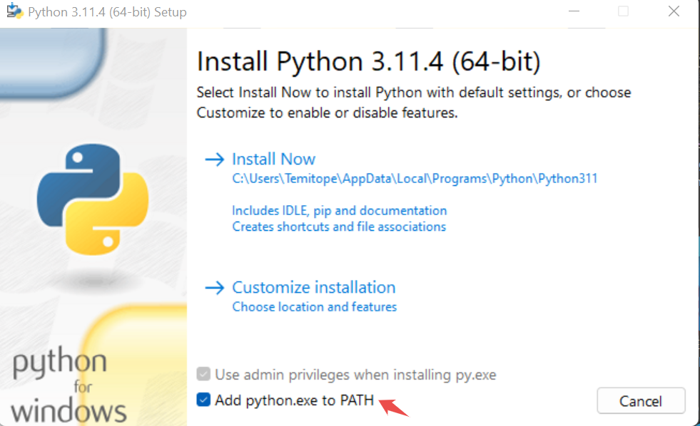
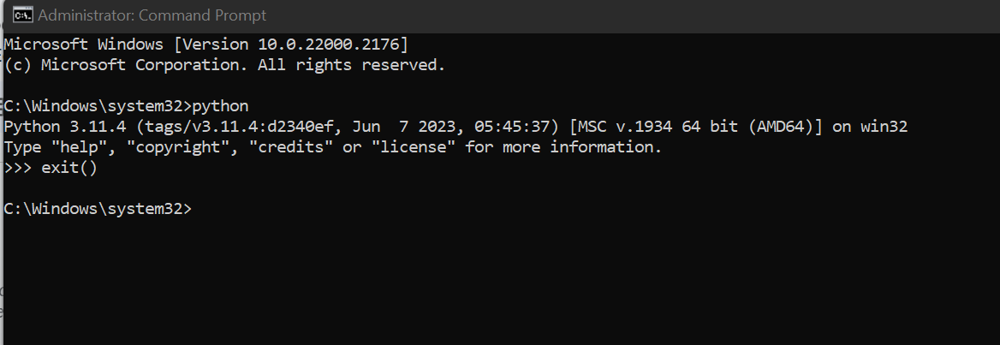

#
<h1 align="center"><b> GETTING STARTED WITH MKDOCS: A BEGINNER'S GUIDE </h1> </b>

<h4 align="center"> Welcome to MkDocs Documentation</h4>

## **Introduction**

The digital age has brought about modern technologies. Businesses are evolving using complex technologies. These technologies require user manuals, user guides and documentation to explicitly state how to use them. Building documentation involves using static site generators.

There are several static site generators built using different languages. Mkdocs comes in handy to solve this problem. Mkdocs is a static site generator used to build project documentation.

This article will cover MkDocs, its installation method, its features, and how to use it.

## **What is MkDocs?**

[Mkdocs](https://www.mkdocs.org/) is a static site generator for building project documentation using Markdown. It is a fast, simple, and lightweight generator, Mkdocs requires Python to set up and markdown as documentation source files. It is configured with a single YAML Configuration File.

[Mkdocs](https://www.mkdocs.org/) supports building HTML
static files completely. It is a Python package to develop and load web
pages. Mkdocs is free to access, and it is geared towards speed and
simplicity.

## **Features of Mkdocs**

- **Customization and Themes**

>There is a stack of good-looking themes included by default on Mkdocs. You can get themes from [GitHub Material](https://github.com/mkdocs/mkdocs/wiki/MkDocs-Themes), readthedocs, and Bootstrap. The project documentation can be customized based on preference using the theme to make it look beautiful.

- **Language and Configuration**

>Mkdocs uses Markdown as the documentation source file. Markdown is an easy markup language to write like HTML. It also uses simple configuration files like YAML to function.

- **Preview Site**

>Mkdocs has a built-in server that allows users to preview documentation. As the documentation is being written in Markdown, it can be previewed on the site immediately. It also auto-reloads when changes are saved. To see the latest edit, refresh the browser, and changes made will show on the preview site.

- **Hosting**

>[Mkdocs](https://www.mkdocs.org/) supports building HTML static sites that can be hosted on GitHub pages, Amazon S3, Netlify or [sites of choice](https://www.mkdocs.org/user-guide/deploying-your-docs/).

- **Speed and Simplicity**

> Mkdocs is very simple to use. It is a static site generator that loads pages very fast.

- **Free to use**

>Mkdocs is free and accessible to all users. It does not require a subscription or payment methods.

## **Requirement/Prerequisites to use Mkdocs**

A recent version of [Python](https://www.python.org/) and Python Package Manager ([PIP](https://pip.pypa.io/en/stable/installation/)) is required to install Mkdocs.

Also, Visual Studio Code, Command Prompt, or Git Bash is required to run
the codes to install mkdocs. Visual Studio Code (VSCode) can be used to
write the documentation source file in Markdown.

## **Installation of Mkdocs**

To install Mkdocs, it is required to install Python and PIP. This
article will cover the detailed steps to install Python and PIP, then
Mkdocs.

### **How to install Python.**

Follow this step-by-step process to install Python on your PC.

1. Install Python from the [Python Download Page](https://www.python.org/downloads/release/python-3114/).

> 

2.Select the operating system in use. This would automatically download the Python file to the local PC.

3.Once the download is complete, launch the Python file. Ensure "add python.exe to PATH" is checked. Select 'Install Now' and this installs Python on the PC.

> 

4.To test if it is properly installed, launch the command prompt on the PC. Type 'python'. This would show the version of Python installed.

> 

## **How to Install PIP**

1. Install PIP using the [PIP Download Page](https://bootstrap.pypa.io/get-pip.py)**.** Try it on multiple browsers if it fails on any browser.

2. Next, open Command Prompt as administrator.

3. Change the directory to where the PIP file is installed using 'cd'. For example, if pip is installed on downloads, change the directory to the path of Downloads."

4. Run the command in the below line.

```bash
'get-pip.py'
```

The command will install Pip on your Windows PC.

> 

### **Steps to install Mkdocs**

Now that you have learnt how to install Python and PIP, you can go ahead
to install Mkdocs.

1. Launch the Command Prompt as an administrator.

2. To install the Mkdocs Package, run the following command:

```
'pip install mkdocs'
```


3.Mkdocs is successfully installed.

## **Mkdocs Alternatives**

1. **Docusaurus** <br>
[Docusaurus](https://docusaurus.io/) is a site generator built with React components. It can build documentation websites, blogs, and marketing pages. It is powered by Markdown and has fast client-side navigation. <br>
   Features of Docusaurus:
     - Document Versioning
     - Translations
     - Host on Github, Amazon S3
     - Deployment to Netlify <br>

2. **Pelican** <br>
   [Pelican](https://docs.getpelican.com/en/latest/) is a Python-based static site generator. It does not require a database or server-side logic Pelican provides a command-line interface (CLI) to regenerate sites. Pelican is an open-source generator. Content can be written directly in reStructuredText or Markdown formats. <br>
   Features of Pelican:
     - Integration with external services
     - Import content from WordPress
     - Fast build times
     - Publicize articles in multiple languages

3. **Jekyll** <br>
   [Jekyll](https://jekyllrb.com/) is a popular open-source static generator. Jekyll supports Markdown. It supports free hosting on GitHub Pages. Jekyll works well for static web pages. Jekyll was written in Ruby. It was released in 2008. Interestingly, Jekyll is the engine behind [GitHub Pages](https://en.wikipedia.org/wiki/GitHub#GitHub_Pages). <br>
   Features of Jekyll:
     - Widely used and easy to use
     - Free and open source
     - It can be used with front-end frameworks such as Bootstrap

4. **Astro Build** <br>
   [Astro Build](https://astro.build/) is a website builder for professional web pages. It has a built-in function that supports Markdown. <br>
   Features of Astro Build:
     - Builds fast content-based websites
     - Free and open-source
